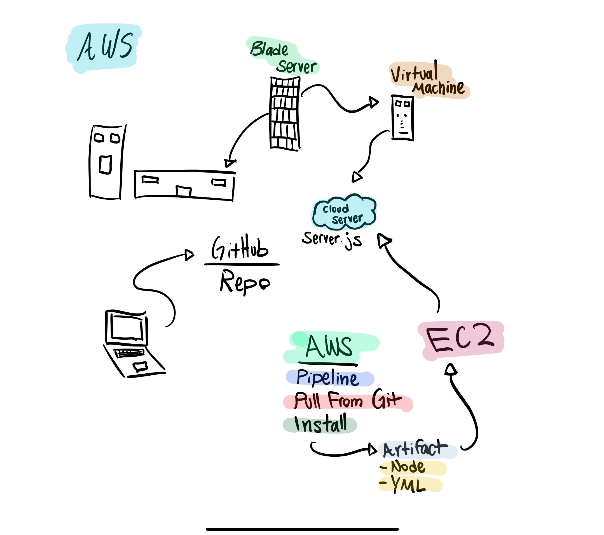

## Lab 19: Socket.io AWS Deployment

### Author: Alvian Joseph

### Links and Resources
* [repo]()

### Documentation
* [jsdoc](./docs/)

### Modules

`./app.js`

`./theword.js`

`./server.js`

`./console.js`

-----

#### `./src/app.js`
* Requires in socket client and connects to amazon server

-----

#### `.console.js`
#### Exported Values and Methods
This module provides a single Socket.io event listener

### Setup
### `.env`
* HOST 
* PORT 

### Running the app
* Run the following commands in order on separate command line instances:
  * `node ./server.js` - to start the Socket.io server
  * `node ./app.js` - to start the Socket.io client logger
  * `node console.js` 

### Tests
* How do you run tests?
  * `npm run test`

### UML
